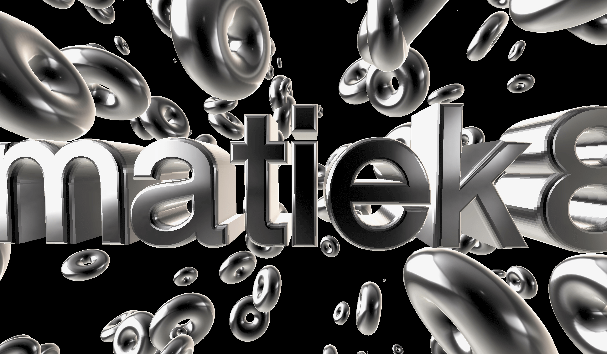

# Three.js
Three.js TextGeometry class. In the project I have big 3D text in the middle of the scene with objects floating around. 
By double clicking on animated area you can switch material from MeshBasicMaterial (wireframe = true) to MeshMatcapMaterial.

Example of MeshBasicMaterial:


Example of MeshMatcapMaterial:



## Setup
Download [Node.js](https://nodejs.org/en/download/).
Run this followed commands:

``` bash
# Install dependencies (only the first time)
npm install

# Run the local server at localhost:8080
npm run dev

# Build for production in the dist/ directory
npm run build
```
